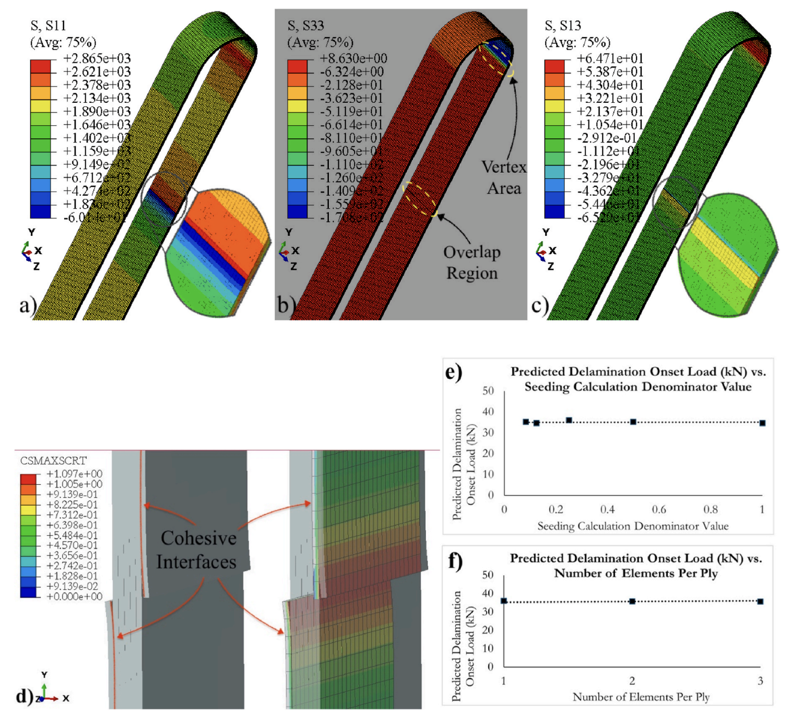

# Example Projects


## 1) [Quick DFOS Strain Analyser](https://github.com/semajrd1/DFOS-Analyser) — Ttkbootstrap GUI and Python-Based Data Processing (Private Repository)


'Quick DFOS Strain Analyser' is a python-based GUI application designed to process, analyse, and visualise distributed fibre optic sensing (DFOS) strain data. The system efficiently handles large datasets using chunk-based data processing, integrates geometric transformations, and provides an interactive visualization interface.

<figure style="text-align: center;">
  <iframe width="340" height="280"
    src="https://www.youtube.com/embed/0f-DgnXBncE?mute=1" 
    frameborder="0" allowfullscreen>
  </iframe>
  <figcaption>Figure 1: Video Demo of Quick DFOS Strain Analyser.</figcaption>
</figure>

<p>&nbsp;</p>

### Key Features
- **Efficient Data Handling** – Optimized for large JSON-based DFOS strain datasets using chunk-based processing.
- **Strain Data Processing** – Extracts, resamples, and interpolates strain data for enhanced accuracy.
- **Geometry-Based Analysis** – Reads structured Excel-based DOF geometry and aligns strain data accordingly.
- **Graphical User Interface (GUI)** – Tkinter-based real-time data visualization and interaction.
- **Performance Optimization** – Implements memory management techniques including garbage collection and process monitoring.
- **Logging & Debugging Support** – Uses structured logging for error tracking and performance analysis.

<p>&nbsp;</p>

### Technology Stack

| Component                        | Technology Used                                   |
| -------------------------------- | ------------------------------------------------- |
| **Frontend**                     | Tkinter (GUI Framework)                           |
| **Backend**                      | Python (NumPy, SciPy, Pandas, multiprocessing)    |
| **Data Handling**                | JSON chunk-based strain data processing           |
| **Geometry Processing**          | Pandas for structured Excel-based transformations |
| **Interpolation and Resampling** | SciPy's `interp1d`, NumPy's `polyfit`             |
| **Performance Optimization**     | `gc`, `psutil`, multiprocessing                   |
| **Logging and Debugging**        | Python’s `logging` module, `traceback`            |
| **File Handling**                | OS, shutil, tempfile                              |

<p>&nbsp;</p>

### Core Processing Workflow
1. **Data Ingestion**: Reads DFOS strain data in chunks to minimize memory footprint.
2. **Preprocessing**: Extracts strain values, applies resampling, and interpolates missing data.
3. **Geometric Alignment**: Reads and processes Excel-based DOF geometry.
4. **Visualization**: Displays real-time strain variations via the Tkinter-based GUI.
5. **Performance Enhancements**: Implements structured logging, garbage collection, and parallel execution.

<p>&nbsp;</p>

### Project Structure
```
├── processing/                  # Core strain and geometry processing modules
│   ├── strain_processing.py     # Extracts, resamples, and interpolates strain data
│   ├── geometry_processing.py   # Reads and aligns DOF geometry with strain measurements
├── gui/                         # Graphical user interface components
│   ├── gui.py                   # Tkinter-based visualization interface
├── utils/                       # Logging and file handling utilities
│   ├── file_helpers.py          # Handles file operations
│   ├── logging_helpers.py       # Manages structured logging
├── main.py                      # Entry point for application execution
├── requirements.txt             # Dependencies
```

<p>&nbsp;</p>

### Building the Executable
This project can be converted into a standalone **Windows EXE** using **PyInstaller**:
```sh
pip install pyinstaller
pyinstaller --onefile --windowed --name "AMRC_DFOS_Analyser" main.py
```
- The `--onefile` flag bundles everything into a single executable.
- The `--windowed` flag ensures the GUI runs without a terminal.
- The output EXE will be found in the `dist/` folder.

<p>&nbsp;</p>

### Execution & Usage
- **Run the application:** `python main.py`
- Alternatively, execute the generated EXE file from `dist/`.
- The GUI initializes and allows real-time strain data visualization.

<!-- ========================================================================================= -->

<p>&nbsp;</p>

## 2) Python Scripting for Composite Strap Modelling in Abaqus [<a href="https://github.com/semajrd1/Abaqus-Macros" target="_blank">Public Repository</a>]

This project is an **Abaqus Python script** that automates the **Finite Element (FE) modeling** of composite straps with **pin-loaded connections**. It defines geometry, meshing, material properties, boundary conditions, and contact interactions, allowing for **efficient simulation setup** and execution in Abaqus CAE.

<figure style="text-align: center;">
  
  <figcaption>Figure 1: Simulation Result</figcaption>
</figure>

The script includes **cohesive zone modeling (CZM)** for analyzing **delamination and failure mechanisms**, making it ideal for **composite structure research and engineering applications**.

<p>&nbsp;</p>

### Features
- **Parametric Geometry Creation** – Define **strap and pin dimensions** in the script for custom models.
- **Advanced Material Properties** – Supports **orthotropic composites** and **isotropic metallic materials**.
- **Cohesive Zone Modeling (CZM)** – Enables **delamination and failure predictions** in laminated composites.
- **Mesh Generation & Refinement** – Uses **adaptive meshing** with fine **curved-edge refinements**.
- **Automated Boundary Conditions & Loads** – Applies **symmetry constraints** and **displacement-driven loading**.
- **Contact & Interaction Definition** – Includes **tie constraints, cohesive contact, and frictional interactions**.
- **Batch Job Submission** – Runs simulations in **Abaqus/CAE** without manual intervention.

<p>&nbsp;</p>

### Installation & Requirements  
- **Abaqus CAE (2020 or later)**
- **Python (compatible with Abaqus scripting, typically Python 2.7 or 3.6)**
- **NumPy & Matplotlib** (for optional post-processing)

<p>&nbsp;</p>

## 3) Responsive Flask Web Application with SQL Database (Isabelle's Baptism) [Public Repo]

This project is a **Flask-based web application** designed to manage guest RSVPs and provide event details for Isabelle’s baptism. The system is built using a **PostgreSQL relational database**, a **responsive front-end**, and a **secure API-driven backend**. It includes a structured MVC pattern and is designed to be **scalable and easily deployable**.

<figure style="text-align: center;">
  <iframe width="340" height="280" 
    src="https://www.youtube.com/embed/7SG_m_pFNII?mute=1" 
    frameborder="0" allowfullscreen>
  </iframe>
  <figcaption>Figure 1: Video Demo of Isabelle's Baptism Web App.</figcaption>
</figure>

<p>&nbsp;</p>

### Key Features
- **Event Information System** – Displays event details with dynamic content rendering through Jinja2 templates.
- **Guest RSVP Management** – Enables user form submission with real-time validation and database storage.
- **Flask Backend with SQLAlchemy ORM** – Manages data persistence with PostgreSQL, with SQLite fallback for local testing.
- **Modular and Scalable Architecture** – Implements separation of concerns with distinct routing, template, and static file management.
- **RESTful API Integration** – Supports data exchange and future expansion into mobile/web applications.
- **Responsive Frontend** – Uses CSS Grid and SASS for layout management and optimized UI across devices.

<p>&nbsp;</p>

### Technology Stack
- **Frontend:** HTML, CSS (SASS), JavaScript
- **Backend:** Flask (Python), Jinja2, SQLAlchemy ORM
- **Database:** PostgreSQL (primary), SQLite (fallback for local development)
- **Security Measures:** Environment variable configurations, database migration compatibility, and input validation.

<p>&nbsp;</p>

### Project Structure
```
├── instance/          # Flask instance folder (e.g., database, sensitive data)
├── static/            # CSS, JavaScript, and images
├── templates/         # HTML templates
├── virtual/           # Virtual environment (not included in Git)
├── .gitignore         # Git ignore file
├── app.py             # Main Flask application
├── requirements.txt   # Dependencies
```

<p>&nbsp;</p>

---

# Technical Competencies

- **Programming Languages**: Python, SQL, MATLAB, C, JavaScript, LaTeX
- **Machine Learning & AI**: TensorFlow, PyTorch, Scikit-learn, YOLO, K-means clustering, Deep Learning
- **Cloud & Databases**: AWS (Lambda, S3, DynamoDB, EC2), Snowflake, PostgreSQL, MySQL
- **Engineering & Simulation Software**: Abaqus, Ansys Workbench, Fusion 360
- **Data Visualization**: Matplotlib, Plotly, Seaborn, Power BI

<p>&nbsp;</p>

---

# Conferences & Presentations

- **Distributed Fibre Optic Sensing for VARTM Composite Manufacturing** – *FPCM 2025, Abu Dhabi, UAE.*
- **Flow Front Monitoring in Pneumatically Spliced Woven Fabrics** – *FPCM 2025, Abu Dhabi, UAE.*
- **On-Line Pneumatic Compaction System for Polymer Towpreg Processing** – *FPCM 2025, Abu Dhabi, UAE.*
- **Stacking Sequence Influence on Notched CF-Epoxy Laminate Performance** – *SAMPE Europe Conf. 2024, Belfast, Northern Ireland.*
- **Use of Waste Plastics/Fibers in High-Performance C-Sections** – *ICCS27, Sep 2024, Bologna, Italy.*
- **Mechanical Characterisation of Pneumatically Spliced Connections** – *ECCM21, Jul 2024, Nantes, France.*
- **Tailored Hybrid Composite Preforms via Fibre Placement** – *ECCM21, Jul 2024, Nantes, France.*
- **Recycled Fibre-Reinforced Thermoplastics: Performance Assessment** – *Polymers 2024, Athens, Greece.*
- **Electrostatic Powder Deposition on Epoxy Tapeline** – *Polymers 2024, Athens, Greece.*
- **Sustainability in Construction: Waste Plastics into High-Value Composites** – *Polymers 2024, Athens, Greece.*
- **Adhesive Joint Design: Composite Layup Tailoring for Stress Optimisation** – *FiBreMod Conf., Dec 2019, Leuven, Belgium.*

<p>&nbsp;</p>

---

# Publications

1. **Fracture-Mechanical Properties of Tailored Epoxy Nanocomposites at Elevated Temperatures** (2024) – *Journal of Applied Polymer Science*.
2. **Experimental and Numerical Investigations on the Tensile Response of Pin-Loaded CFRP Straps** (2024) – *Composites Science and Technology*.
3. **Developing Hybrid C-Sections from Waste and Recycled Composite Materials** (2024) – *Sustainable Materials and Technologies*.
4. **Advanced Ultrasonic Inspection of Thick-Section Composite Structures** (2023) – *Polymers*.
5. **Mechanical Characterisation of Pneumatically-Spliced Carbon Fibre Yarns** (2022) – *Materials & Design*.
6. **Interlaminar Fracture Properties of CFRP Composites with Embedded Toughened Film** (2021) – *Polymers*.
7. **Powder Epoxy for One-Shot Cure: Lap Shear Strength and Z-Pinning Study** (2021) – *Journal of Composite Science*.
8. **Modification of Commercial Bisphenol-A-Based Epoxy Resin Using Multifunctional Epoxy Systems** (2021) – *Applied Mechanics*.

<p>&nbsp;</p>

---

# Certifications

- **Dynamic Public Speaking** – University of Washington (Coursera)
- **DeepLearning.AI TensorFlow Developer** – DeepLearning.AI
- **IBM AI Engineering** – IBM Skills Network
- **CS50x Harvard Introduction to Computer Science** – Harvard University
  
# Online Profiles

- [LinkedIn](https://www.linkedin.com/in/james-davidson-698431259/)
- [Google Scholar](https://scholar.google.com/citations?user=OzPJcVwAAAAJ&hl=en)
- [GitHub](https://semajrd1.github.io/Portfolio/)
